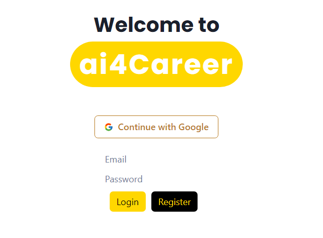

# ai4Career - Personal Career Advisor 
# 2nd Place in innovAIte AINU x BAIC Hackathon


## Overview

AI4Career is a student for student project, it leverages cutting-edge AI technology to provide personalized, insightful career advice and academic planning support to students at crucial pathways of their educational journey. Targeted at high school students applying to university, first-year university students, and those uncertain about their career paths, AI4Career aims to demystify the process of making informed decisions regarding education and career.

## Target Audience

- High school students applying to universities
- First-year university students
- Students uncertain about their career paths

## Features

- **User Authentication and Profile Management**: Implements Firebase for secure user authentication, enabling the creation and management of detailed user profiles.
- **Survey-Driven Insights**: Customizable surveys/questionaires to understand user preferences, skills, and interests, aiding in the accurate personalization of career advice.
- **Personalized Career Advice**: Utilizes AI to offer tailored career guidance, answering questions and providing recommendations based on individual user profiles.
- **Interactive Career Path Exploration**: Engages users with a swiping action - based on dating app, allowing them to explore various career and academic paths through interactive decision-making.
- **Data Analysis and Visualization (Future Extensions)**: Employs advanced data processing techniques for insightful user profile analysis, showcased through interactive graphs and history tracking.
- **Resource Hub**: Provides access to a curated collection of resources for personal development, academic planning, and career exploration.

## Technical Stack

- **Frontend**: React.js and JavaScript - Utilized for building a dynamic and responsive user interface that enhances user experience.
- **Backend**: Node.js with Express.js - Employs Node.js as the runtime environment and Express.js for structuring the server-side logic, facilitating efficient data processing and API management.
- **Database**: Firebase - Used for secure user authentication, real-time data storage, and user profile management.

## Project Setup

To get started with AI4Career:

```bash
# Clone the repository
git clone ...

# Navigate to the project directory
cd backend

# Install dependencies 
npm install
# Start the server 
npm start
```
For frontend:
```bash

# Navigate to the project directory
cd frontend

# Install dependencies 
npm install
# Start the server 
npm start
```
## Contributions - Team AI4Good
- Son Nguyen - Full Stack (Frontend, Backend, Database)
- Khoi Ngo - Backend, Prompt Engineer
- Jonathan Sudarpo - Backend, Prompt Engineer
- Vidyut Ramanan - Frontend, Presenter
- Yuxi Zhou - Designer, Presenter
- Nikita Sopochkin - Presenter, Financial + Ethics Analyst

